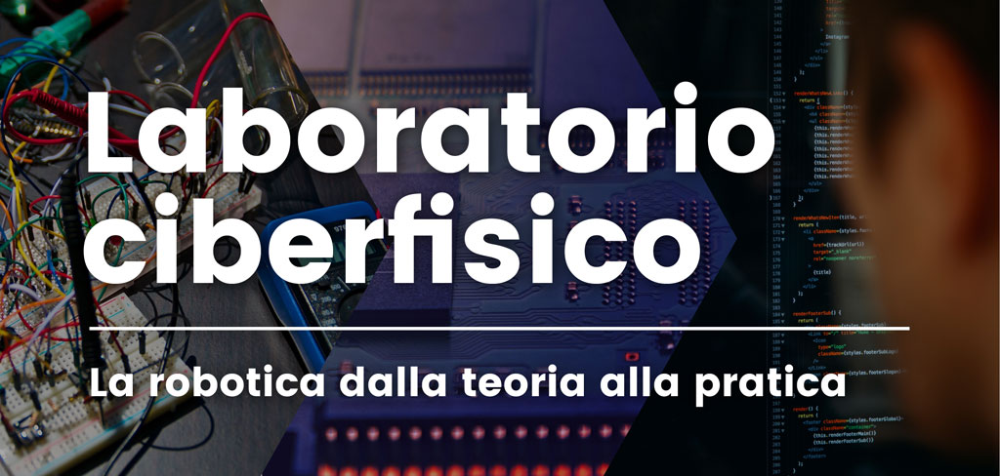

# hello_ros my first ros package

This file is part of hello_ros and it is distributed under the terms of the
GNU Lesser General Public License (Lesser GPL)

hello_ros is included in the material of the courses (in italian) 
- [Sistemi Informativi](https://dbloisi.github.io/corsi/sistemi-informativi.html) 
  
  A.Y. 2018/2019 
  University of Basilicata (Italy)

- Laboratorio Ciberfisico 
  [Robot Programming with ROS](http://profs.scienze.univr.it/~bloisi/corsi/ciberfisico.html) 
  A.Y. 2017/2018 
  University of Verona (Italy)

  
 
hello_ros is distributed in the hope that it will be useful,
but WITHOUT ANY WARRANTY; without even the implied warranty of
MERCHANTABILITY or FITNESS FOR A PARTICULAR PURPOSE.  See the
GNU Lesser General Public License for more details.

You should have received a copy of the GNU Lesser General Public License
along with hello_ros.  If not, see <http://www.gnu.org/licenses/>.

The files in hello_ros contain the ROS based implementation for
a simple publisher/subscriber mechanism.

see [this file](hello-ros.pdf) for additional information (in italian)

 
Please, report suggestions/comments/bugs to 
domenico.bloisi@gmail.com
